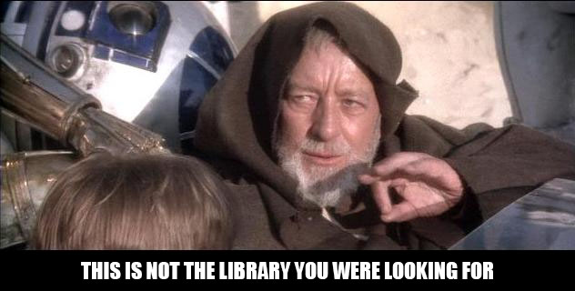

CreditsRoll
===========

The **CreditsRoll** library allows you to have **Star Wars-like credits rolls** in your app. It's compatible with
_all_ API levels. Yes, this is API 1+!

### Why?

Because a), freaking _Star Wars_, and b), why not.

### No seriously, why?

This is an example of custom View, that uses a few interesting tricks to achieve the end result:

* Custom text measuring and laying out, using a
[`StaticLayout`](http://developer.android.com/reference/android/text/StaticLayout.html)
* 3D view transform on a [`Canvas`](http://developer.android.com/reference/android/graphics/Canvas.html)
using a [`Camera`](http://developer.android.com/reference/android/graphics/Camera.html)
* Custom view attributes handling
* Rickroll

### License
This library is released under the Apache 2 License. Please take a look at the [`NOTICE`](NOTICE) file for details.

### Third party libraries
The demo app uses the amazing [NineOldAndroids](http://nineoldandroids.com) library by Jake Wharton to support
using Honeycomb-style animations on API level 1+.
